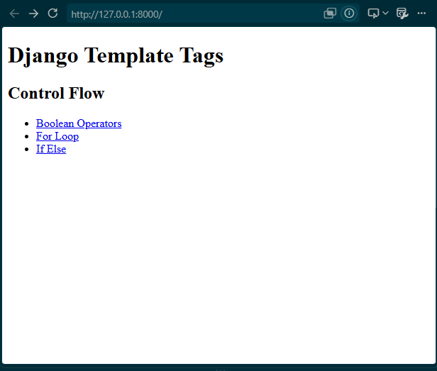
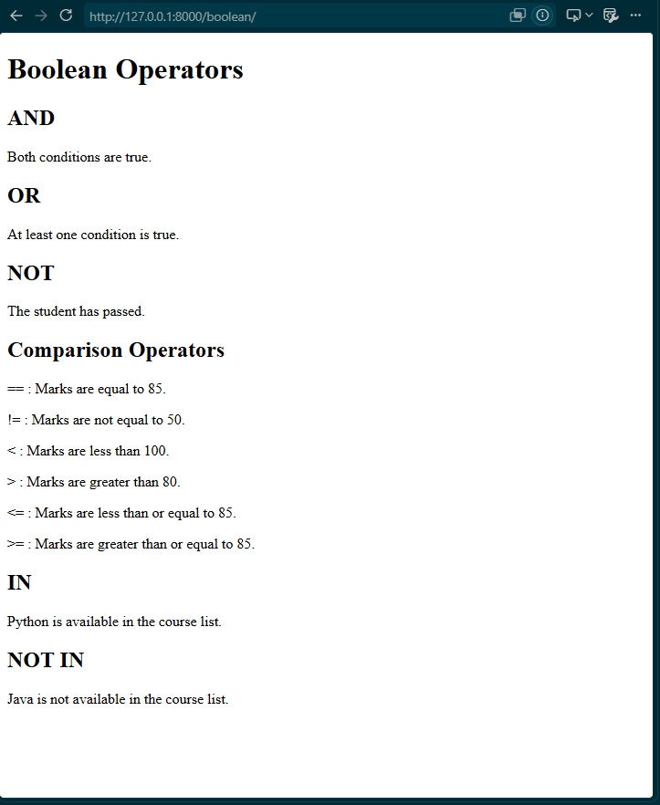
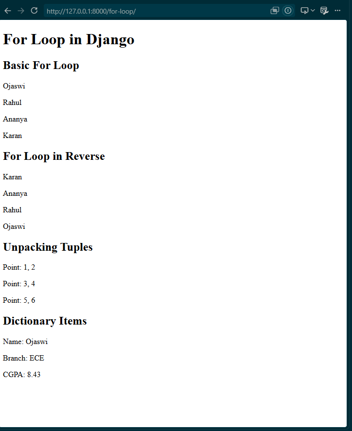
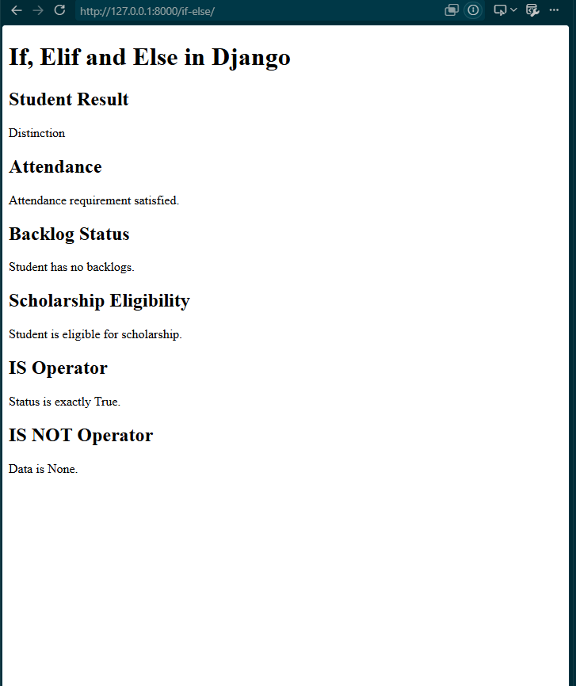

Create/open:

```text
08-django-template-tags/README.md
```

and paste this:

# Django Template Tags — Project 8

This project demonstrates **Django Template Tags and Control Flow** using a minimal Django application.

The project focuses on how Django templates can use conditional statements and loops to dynamically generate HTML based on data passed from the Django view.

The main concepts demonstrated in this project are:

* Boolean operators
* Comparison operators
* Membership operators
* `if`
* `elif`
* `else`
* `for` loops
* Reverse `for` loops
* Tuple unpacking
* Dictionary iteration using `.items`
* `is`
* `is not`
* Passing data from views to templates
* URL routing
* Rendering templates using Django views

The project is intentionally kept minimal because its purpose is to understand **Django Template Tags**, rather than build a large application.

---

# 1. Project Objective

The objective of this project is to understand how Django Template Tags can be used to control what is displayed on a webpage.

In Django, the view is responsible for preparing data, while the template is responsible for displaying that data.

The basic flow is:

```text
Browser
   ↓
URL
   ↓
View
   ↓
Context Data
   ↓
Template
   ↓
HTML Response
```

For example, the view can send:

```python
context = {
    "marks": 85,
}
```

The template can then use:

```django

    <p>Student has passed.</p>

```

The template decides what HTML should be displayed based on the value received from the view.

---

# 2. Project Structure

The project has the following structure:

```text
08-django-template-tags/
│
├── manage.py
│
├── template_tags/
│   ├── __init__.py
│   ├── settings.py
│   ├── urls.py
│   ├── asgi.py
│   └── wsgi.py
│
├── tags/
│   ├── migrations/
│   │
│   ├── templates/
│   │   └── tags/
│   │       ├── home.html
│   │       ├── boolean.html
│   │       ├── for_loop.html
│   │       └── if_else.html
│   │
│   ├── __init__.py
│   ├── admin.py
│   ├── apps.py
│   ├── models.py
│   ├── tests.py
│   ├── urls.py
│   └── views.py
│
├── screenshots/
│   ├── home.png
│   ├── boolean_operators.png
│   ├── for_loop.png
│   └── if_else.png
│
└── README.md
```

---

# 3. Creating the Project

The project was created inside the existing Django learning repository.

The Project 8 folder is:

```text
08-django-template-tags
```

The Django project was created using:

```bash
django-admin startproject template_tags .
```

The `.` at the end is important because it tells Django to create the project inside the current directory.

This creates:

```text
manage.py
template_tags/
```

---

# 4. Creating the Django App

A Django application named `tags` was created using:

```bash
python manage.py startapp tags
```

This created the standard Django application files:

```text
tags/
├── admin.py
├── apps.py
├── models.py
├── tests.py
├── views.py
└── migrations/
```

The application was then added to `INSTALLED_APPS` in:

```text
template_tags/settings.py
```

The configuration is:

```python
INSTALLED_APPS = [
    "django.contrib.admin",
    "django.contrib.auth",
    "django.contrib.contenttypes",
    "django.contrib.sessions",
    "django.contrib.messages",
    "django.contrib.staticfiles",
    "tags",
]
```

Adding `"tags"` tells Django that the application is part of the project.

---

# 5. Views

The views are located in:

```text
tags/views.py
```

The complete code is:

```python
from django.shortcuts import render


def home(request):
    return render(request, "tags/home.html")


def boolean_operators(request):
    context = {
        "age": 21,
        "marks": 85,
        "name": "Ojaswi",
        "courses": ["Python", "Django", "SQL"],
    }

    return render(request, "tags/boolean.html", context)


def for_loop(request):
    context = {
        "students": ["Ojaswi", "Rahul", "Ananya", "Karan"],
        "points": [(1, 2), (3, 4), (5, 6)],
        "student_info": {
            "Name": "Ojaswi",
            "Branch": "ECE",
            "CGPA": 8.43,
        },
    }

    return render(request, "tags/for_loop.html", context)


def if_else(request):
    context = {
        "marks": 85,
        "attendance": 82,
        "has_backlogs": False,
        "status": True,
        "optional_data": None,
    }

    return render(request, "tags/if_else.html", context)
```

---

# 6. Understanding `render()`

Django provides the `render()` function through:

```python
from django.shortcuts import render
```

The basic syntax is:

```python
return render(request, "template.html", context)
```

For example:

```python
return render(request, "tags/boolean.html", context)
```

This tells Django to:

1. Receive the HTTP request.
2. Load `boolean.html`.
3. Pass the `context` dictionary to the template.
4. Render the template.
5. Return the generated HTML response to the browser.

---

# 7. Context Data

A context is a Python dictionary containing data that is passed from a view to a template.

Example:

```python
context = {
    "age": 21,
    "marks": 85,
    "name": "Ojaswi",
}
```

The template can access these values using:

```django
{{ age }}
{{ marks }}
{{ name }}
```

Django templates use:

```text
{{ }}
```

for displaying variables.

They use:

```text

```

for template tags.

For example:

```django
{{ marks }}
```

displays a value.

Whereas:

```django

```

performs template logic.

---

# 8. URL Configuration

The application has its own URL configuration in:

```text
tags/urls.py
```

The complete code is:

```python
from django.urls import path
from .views import home, boolean_operators, for_loop, if_else

urlpatterns = [
    path("", home, name="home"),
    path("boolean/", boolean_operators, name="boolean"),
    path("for-loop/", for_loop, name="for_loop"),
    path("if-else/", if_else, name="if_else"),
]
```

There are four URLs.

| URL          | View                | Purpose           |
| ------------ | ------------------- | ----------------- |
| `/`          | `home`              | Home page         |
| `/boolean/`  | `boolean_operators` | Boolean operators |
| `/for-loop/` | `for_loop`          | For loops         |
| `/if-else/`  | `if_else`           | If/elif/else      |

---

# 9. Project-Level URLs

The main URL configuration is:

```text
template_tags/urls.py
```

The complete code is:

```python
from django.contrib import admin
from django.urls import include, path

urlpatterns = [
    path("admin/", admin.site.urls),
    path("", include("tags.urls")),
]
```

The important line is:

```python
path("", include("tags.urls")),
```

This tells Django to send the application's URL requests to:

```text
tags/urls.py
```

Therefore:

```text
/
```

is handled by:

```python
home
```

and:

```text
/boolean/
```

is handled by:

```python
boolean_operators
```

---

# 10. Templates

The templates are stored inside:

```text
tags/templates/tags/
```

The four HTML files are:

```text
home.html
boolean.html
for_loop.html
if_else.html
```

Each concept has its own HTML page so that the examples remain simple and easy to understand.

---

# 11. Home Page

The home page is:

```text
tags/templates/tags/home.html
```

Complete code:

```html
<!DOCTYPE html>
<html>
<head>
    <title>Django Template Tags</title>
</head>
<body>

    <h1>Django Template Tags</h1>

    <h2>Control Flow</h2>

    <ul>
        <li><a href="/boolean/">Boolean Operators</a></li>
        <li><a href="/for-loop/">For Loop</a></li>
        <li><a href="/if-else/">If Else</a></li>
    </ul>

</body>
</html>
```

The home page acts as a simple navigation page.

The links direct the user to the three different examples.

---

# 12. Boolean Operators

The Boolean Operators example is located in:

```text
tags/templates/tags/boolean.html
```

Complete code:

```html
<!DOCTYPE html>
<html>
<head>
    <title>Boolean Operators</title>
</head>
<body>

    <h1>Boolean Operators</h1>

    <h2>AND</h2>

    
        <p>Both conditions are true.</p>
    


    <h2>OR</h2>

    
        <p>At least one condition is true.</p>
    


    <h2>NOT</h2>

    
        <p>The student has passed.</p>
    


    <h2>Comparison Operators</h2>

    
        <p>== : Marks are equal to 85.</p>
    

    
        <p>!= : Marks are not equal to 50.</p>
    

    
        <p>&lt; : Marks are less than 100.</p>
    

    
        <p>&gt; : Marks are greater than 80.</p>
    

    
        <p>&lt;= : Marks are less than or equal to 85.</p>
    

    
        <p>&gt;= : Marks are greater than or equal to 85.</p>
    


    <h2>IN</h2>

    
        <p>Python is available in the course list.</p>
    


    <h2>NOT IN</h2>

    
        <p>Java is not available in the course list.</p>
    


    <hr>

    <a href="/">Home</a> |
    <a href="/boolean/">Boolean Operators</a> |
    <a href="/for-loop/">For Loop</a> |
    <a href="/if-else/">If Else</a>

</body>
</html>
```

---

# 13. `and` Operator

The `and` operator checks whether all specified conditions are true.

Example:

```django

    <p>Both conditions are true.</p>

```

The condition requires:

```text
age >= 18
AND
marks >= 40
```

Both must be true for the content to appear.

The context contains:

```python
"age": 21,
"marks": 85,
```

Therefore both conditions are true.

---

# 14. `or` Operator

The `or` operator checks whether at least one condition is true.

Example:

```django

    <p>At least one condition is true.</p>

```

Here:

```text
marks >= 90
```

is false because marks are 85.

However:

```text
age >= 21
```

is true.

Therefore the complete `or` condition is true.

---

# 15. `not` Operator

The `not` operator reverses the result of a condition.

Example:

```django

    <p>The student has passed.</p>

```

Since:

```text
marks < 40
```

is false, applying `not` makes the condition true.

---

# 16. Comparison Operators

Django templates support comparison operators.

### Equal to

```django

```

Checks whether marks are exactly 85.

### Not equal to

```django

```

Checks whether marks are not 50.

### Less than

```django

```

Checks whether marks are below 100.

### Greater than

```django

```

Checks whether marks are above 80.

### Less than or equal to

```django

```

Checks whether marks are 85 or lower.

### Greater than or equal to

```django

```

Checks whether marks are 85 or higher.

---

# 17. `in` Operator

The `in` operator checks whether a value exists inside an iterable.

The view contains:

```python
"courses": ["Python", "Django", "SQL"],
```

The template checks:

```django

    <p>Python is available in the course list.</p>

```

Since Python exists in the list, the message is displayed.

---

# 18. `not in` Operator

The `not in` operator checks whether a value does not exist inside an iterable.

Example:

```django

    <p>Java is not available in the course list.</p>

```

Since Java is not present in:

```python
["Python", "Django", "SQL"]
```

the condition is true.

---

# 19. For Loop

The For Loop example is located in:

```text
tags/templates/tags/for_loop.html
```

Complete code:

```html
<!DOCTYPE html>
<html>
<head>
    <title>For Loop</title>
</head>
<body>

    <h1>For Loop in Django</h1>

    <h2>Basic For Loop</h2>

    
        <p>{{ student }}</p>
    


    <h2>For Loop in Reverse</h2>

    
        <p>{{ student }}</p>
    


    <h2>Unpacking Tuples</h2>

    
        <p>Point: {{ x }}, {{ y }}</p>
    


    <h2>Dictionary Items</h2>

    
        <p>{{ key }}: {{ value }}</p>
    


    <hr>

    <a href="/">Home</a> |
    <a href="/boolean/">Boolean Operators</a> |
    <a href="/for-loop/">For Loop</a> |
    <a href="/if-else/">If Else</a>

</body>
</html>
```

---

# 20. Basic `for` Loop

The view contains:

```python
"students": ["Ojaswi", "Rahul", "Ananya", "Karan"],
```

The template iterates over the list:

```django

    <p>{{ student }}</p>

```

The loop executes once for every item.

The output is:

```text
Ojaswi
Rahul
Ananya
Karan
```

The syntax is:

```django

    ...

```

`item` represents the current element.

`iterable` is the collection being processed.

---

# 21. Reverse `for` Loop

Django templates allow a list to be iterated in reverse using:

```django

    <p>{{ student }}</p>

```

The original list is:

```text
Ojaswi
Rahul
Ananya
Karan
```

The reverse order becomes:

```text
Karan
Ananya
Rahul
Ojaswi
```

The `reversed` keyword is added directly to the `for` tag.

---

# 22. Tuple Unpacking

The view contains:

```python
"points": [
    (1, 2),
    (3, 4),
    (5, 6)
],
```

Each item contains two values.

The template can unpack them directly:

```django

    <p>Point: {{ x }}, {{ y }}</p>

```

The first iteration gives:

```text
x = 1
y = 2
```

The second gives:

```text
x = 3
y = 4
```

The third gives:

```text
x = 5
y = 6
```

---

# 23. Iterating Over a Dictionary

The view contains:

```python
"student_info": {
    "Name": "Ojaswi",
    "Branch": "ECE",
    "CGPA": 8.43,
},
```

Django templates can iterate over the dictionary's key-value pairs using `.items`:

```django

    <p>{{ key }}: {{ value }}</p>

```

This produces:

```text
Name: Ojaswi
Branch: ECE
CGPA: 8.43
```

Here:

```text
key
```

contains the dictionary key.

And:

```text
value
```

contains the corresponding value.

---

# 24. If, Elif and Else

The third example is:

```text
tags/templates/tags/if_else.html
```

Complete code:

```html
<!DOCTYPE html>
<html>
<head>
    <title>If Else</title>
</head>
<body>

    <h1>If, Elif and Else in Django</h1>

    <h2>Student Result</h2>

    
        <p>Distinction</p>

    
        <p>Passed</p>

    
        <p>Failed</p>
    


    <h2>Attendance</h2>

    
        <p>Attendance requirement satisfied.</p>

    
        <p>Attendance requirement not satisfied.</p>
    


    <h2>Backlog Status</h2>

    
        <p>Student has backlogs.</p>

    
        <p>Student has no backlogs.</p>
    


    <h2>Scholarship Eligibility</h2>

    
        <p>Student is eligible for scholarship.</p>

    
        <p>Student is not eligible for scholarship.</p>
    


    <h2>IS Operator</h2>

    
        <p>Status is exactly True.</p>
    


    <h2>IS NOT Operator</h2>

    
        <p>Data is available.</p>
    
        <p>Data is None.</p>
    


    <hr>

    <a href="/">Home</a> |
    <a href="/boolean/">Boolean Operators</a> |
    <a href="/for-loop/">For Loop</a> |
    <a href="/if-else/">If Else</a>

</body>
</html>
```

---

# 25. `if` Tag

The `if` tag evaluates a condition.

Example:

```django

    <p>Distinction</p>

```

If marks are 75 or higher, the paragraph is rendered.

If the condition is false, nothing inside the block is rendered.

The block ends with:

```django

```

---

# 26. `elif`

`elif` allows multiple conditions to be checked.

Example:

```django

    <p>Distinction</p>


    <p>Passed</p>


    <p>Failed</p>

```

The conditions are checked from top to bottom.

For:

```text
marks = 85
```

the first condition is true:

```text
85 >= 75
```

Therefore:

```text
Distinction
```

is displayed.

The later conditions are not evaluated for rendering.

---

# 27. `else`

The `else` block executes when all preceding conditions are false.

Example:

```django

    <p>Distinction</p>


    <p>Passed</p>


    <p>Failed</p>

```

If marks are:

```text
30
```

then:

```text
30 >= 75
```

is false.

And:

```text
30 >= 40
```

is also false.

Therefore the `else` block is displayed:

```text
Failed
```

---

# 28. Combining `if` With Boolean Operators

Django allows Boolean operators to be used inside `if` conditions.

The project uses:

```django

    <p>Student is eligible for scholarship.</p>

    <p>Student is not eligible for scholarship.</p>

```

There are three requirements:

```text
marks >= 75
```

AND

```text
attendance >= 75
```

AND

```text
not has_backlogs
```

The student is eligible only when all three conditions are satisfied.

The current values are:

```python
"marks": 85,
"attendance": 82,
"has_backlogs": False,
```

Therefore:

```text
85 >= 75       → True
82 >= 75       → True
not False      → True
```

All conditions are true, so the student is eligible.

---

# 29. `is` Operator

The `is` operator checks object identity.

The view contains:

```python
"status": True,
```

The template checks:

```django

    <p>Status is exactly True.</p>

```

This checks whether `status` is exactly the Boolean value `True`.

---

# 30. `is not` Operator

The `is not` operator is the opposite of `is`.

The view contains:

```python
"optional_data": None,
```

The template checks:

```django

    <p>Data is available.</p>

    <p>Data is None.</p>

```

Since the current value is:

```python
None
```

the `is not None` condition is false.

Therefore the `else` block is displayed.

---

# 31. Difference Between `is` and `==`

These operators should not be confused.

`==` checks whether two values are equal.

Example:

```django

```

`is` checks whether the objects are the same identity.

Example:

```django

```

For normal value comparisons, `==` is generally the appropriate operator.

`is` is particularly useful for checking values such as:

```django

```

or:

```django

```

---

# 32. Important Django Template Syntax

Django templates use two major types of syntax in this project.

## Variables

Variables are displayed using:

```django
{{ variable }}
```

Example:

```django
{{ marks }}
```

If:

```python
marks = 85
```

the browser displays:

```text
85
```

## Template Tags

Template tags are written using:

```django

```

Examples:

```django

```

and:

```django

```

Template tags control the behavior of the template.

---

# 33. Screenshots

The project contains screenshots showing the output of each page.

## Home Page



## Boolean Operators



## For Loop



## If / Elif / Else



---

# 34. Running the Project

First, activate the virtual environment if it is not already active.

Then navigate to:

```bash
cd 08-django-template-tags
```

Run the development server:

```bash
python manage.py runserver
```

Django starts the development server at:

```text
http://127.0.0.1:8000/
```

---

# 35. Available Pages

## Home

```text
http://127.0.0.1:8000/
```

## Boolean Operators

```text
http://127.0.0.1:8000/boolean/
```

## For Loop

```text
http://127.0.0.1:8000/for-loop/
```

## If / Elif / Else

```text
http://127.0.0.1:8000/if-else/
```

---

# 36. Testing the Project

The project can be tested by changing the values in `views.py`.

For example, change:

```python
"marks": 85,
```

to:

```python
"marks": 30,
```

Then refresh the page.

The `if`, `elif`, and `else` blocks will produce different output.

Similarly, changing:

```python
"has_backlogs": False,
```

to:

```python
"has_backlogs": True,
```

will change the scholarship eligibility result.

Changing:

```python
"courses": ["Python", "Django", "SQL"],
```

to:

```python
"courses": ["Django", "SQL"],
```

will cause the `Python in courses` condition to become false.

This demonstrates that the template output is dynamically controlled by the data passed from the view.

---

# 37. What This Project Demonstrates

This project demonstrates the following Django Template Tag concepts:

### Boolean Operators

```django
and
or
not
```

### Comparison Operators

```django
==
!=
<
>
<=
>=
```

### Membership Operators

```django
in
not in
```

### Identity Operators

```django
is
is not
```

### Conditional Tags

```django




```

### Loop Tags

```django


```

### Reverse Iteration

```django

```

### Tuple Unpacking

```django

```

### Dictionary Iteration

```django

```

---

# 38. Key Learning

The main concept learned from this project is that Django templates are not limited to displaying static HTML.

Templates can make rendering decisions based on data provided by the view.

For example:

```python
context = {
    "marks": 85,
}
```

can be processed by:

```django

    <p>Distinction</p>

    <p>Passed</p>

    <p>Failed</p>

```

Similarly, a Python list:

```python
students = ["Ojaswi", "Rahul", "Ananya"]
```

can be displayed dynamically:

```django

    <p>{{ student }}</p>

```

This allows the same HTML template to work with different data.

---

# 39. MVT Flow in This Project

The project follows Django's MVT architecture.

```text
             URL
              │
              ▼
            View
              │
              │ Context
              ▼
          Template
              │
       Template Tags
              │
              ▼
       Generated HTML
              │
              ▼
           Browser
```

For example:

```text
/boolean/
     ↓
boolean_operators()
     ↓
{
    age: 21,
    marks: 85,
    courses: [...]
}
     ↓
boolean.html
     ↓





     ↓
HTML response
```

---

# 40. Conclusion

This project provides a minimal practical demonstration of Django Template Tags.

Instead of creating a large application, each major concept is demonstrated on its own page:

```text
Home
  │
  ├── Boolean Operators
  │
  ├── For Loop
  │
  └── If / Elif / Else
```

The project shows how data is passed from Django views into templates and how template tags can use that data to dynamically control the content displayed in the browser.

This project forms the foundation for more advanced Django concepts such as:

* Template inheritance
* Template filters
* Forms
* Models
* Database-driven pages
* Dynamic user interfaces
* Authentication and authorization
* More advanced Django applications

---

# 41. Technologies Used

* Python
* Django
* HTML
* Django Template Language
* VS Code
* Git
* GitHub

---

# 42. Project Status

**Completed**

