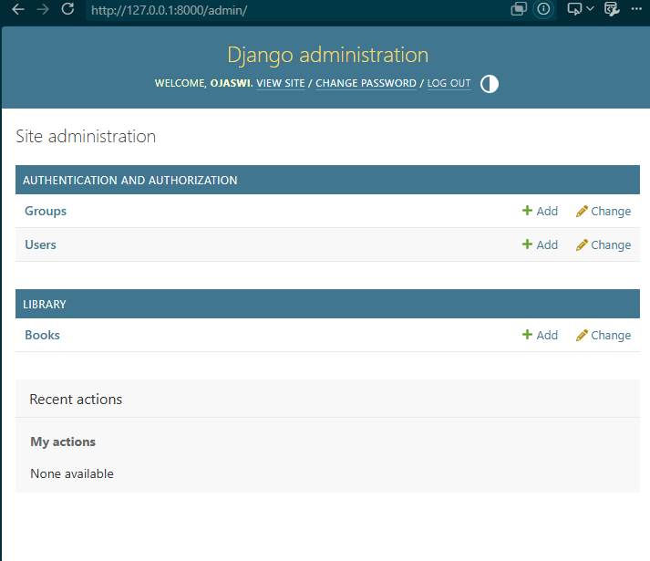
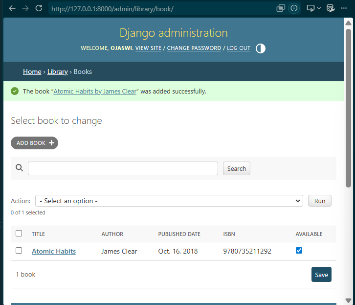
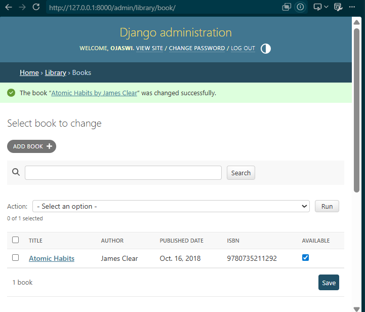
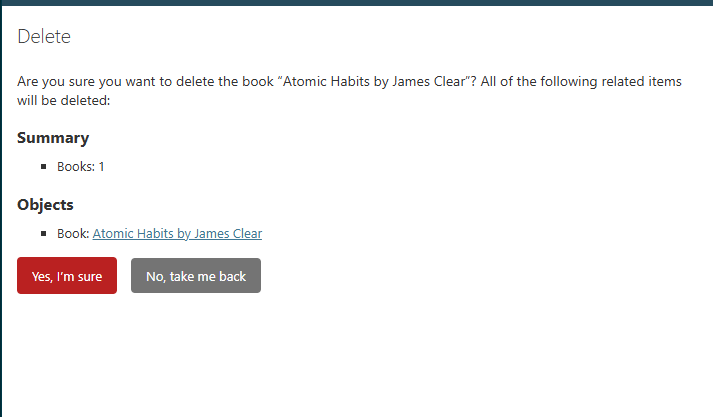
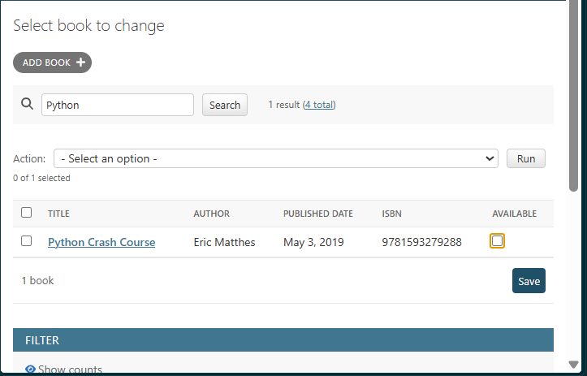
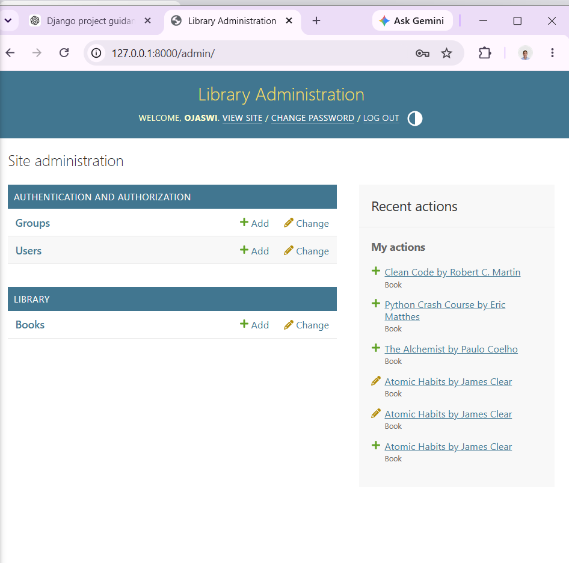
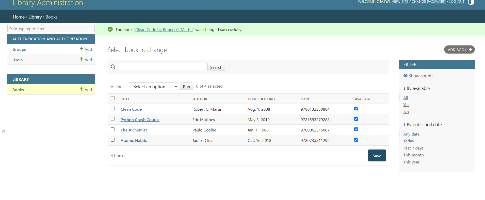
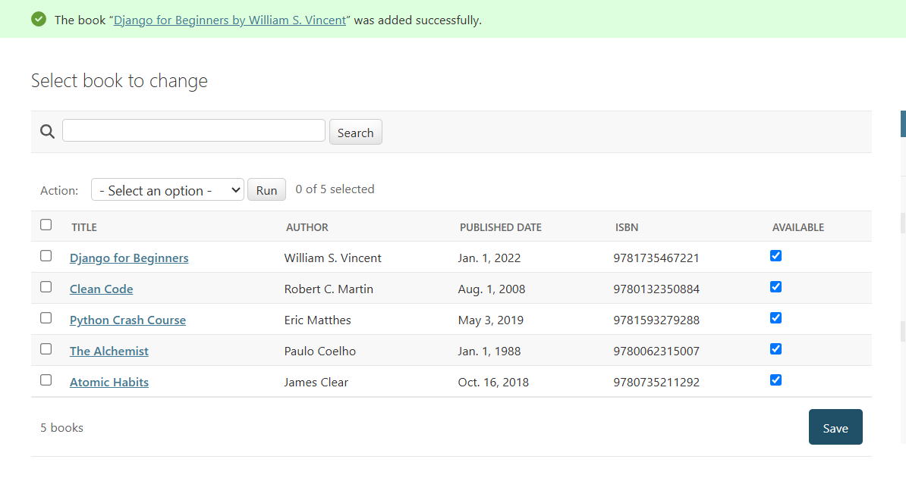

# Django Admin — Project 9

This project demonstrates the **Django Admin Interface** and how it can be used to manage database records through a ready-made web interface.

The project uses a simple **Book Management** model to demonstrate:

* Creating a Django superuser
* Accessing the Django Admin
* Creating models
* Running migrations
* Registering models in Admin
* CRUD operations
* `__str__()` method
* `list_display`
* `search_fields`
* `list_filter`
* `list_editable`
* Changing the order of fields
* Customizing the Django Admin branding
* Managing records through the browser

The project is intentionally minimal because the purpose is to understand how Django Admin works rather than build a complete library-management application.

---

# 1. Project Objective

Django provides a built-in administration interface that allows developers and administrators to manage application data through a browser.

Instead of creating separate HTML pages and forms for every database operation, Django Admin automatically generates an interface for registered models.

The basic flow in this project is:

```text
Django Model
     ↓
Database
     ↓
Register Model in Admin
     ↓
Create Superuser
     ↓
Login to /admin/
     ↓
Manage Book Records
     ↓
Create / Read / Update / Delete
```

The project uses a `Book` model as the example.

---

# 2. Project Structure

The project has the following structure:

```text
09-django-admin/
│
├── manage.py
│
├── admin_project/
│   ├── __init__.py
│   ├── settings.py
│   ├── urls.py
│   ├── asgi.py
│   └── wsgi.py
│
├── library/
│   ├── migrations/
│   │   └── ...
│   ├── __init__.py
│   ├── admin.py
│   ├── apps.py
│   ├── models.py
│   ├── tests.py
│   └── views.py
│
├── templates/
│   └── admin/
│       └── base_site.html
│
├── screenshots/
│   ├── 1_admin_dashboard.png
│   ├── 2_book_list.png
│   ├── 3_edit_book.png
│   ├── 4_delete_confirmation.png
│   ├── 5_search_filter.png
│   ├── 6_custom_admin.png
│   ├── 7_list_editable.png
│   ├── 8_admin_login.png
│   └── 9_final_book_list.png
│
└── README.md
```

---

# 3. Creating the Django Project

The project was created inside the existing Django learning repository.

The Project 9 directory is:

```text
09-django-admin
```

The Django project was created using:

```bash
django-admin startproject admin_project .
```

The `.` at the end is important because it creates the Django project inside the current directory instead of creating an unnecessary nested directory.

This creates:

```text
manage.py
admin_project/
```

---

# 4. Creating the Application

A Django application called `library` was created using:

```bash
python manage.py startapp library
```

This created the standard Django application structure:

```text
library/
├── migrations/
├── admin.py
├── apps.py
├── models.py
├── tests.py
└── views.py
```

The `library` application was added to `INSTALLED_APPS` in:

```text
admin_project/settings.py
```

The configuration contains:

```python
INSTALLED_APPS = [
    "django.contrib.admin",
    "django.contrib.auth",
    "django.contrib.contenttypes",
    "django.contrib.sessions",
    "django.contrib.messages",
    "django.contrib.staticfiles",
    "library",
]
```

Adding `"library"` tells Django that this application is part of the project.

---

# 5. Creating the Book Model

The main model for this project is `Book`.

The model is defined in:

```text
library/models.py
```

Complete code:

```python
from django.db import models


class Book(models.Model):
    title = models.CharField(max_length=200)
    author = models.CharField(max_length=100)
    published_date = models.DateField()
    isbn = models.CharField(max_length=13, unique=True)
    pages = models.IntegerField()
    available = models.BooleanField(default=True)

    def __str__(self):
        return f"{self.title} by {self.author}"
```

---

# 6. Understanding the Book Model

The model contains six fields.

## `title`

```python
title = models.CharField(max_length=200)
```

This stores the title of the book.

`CharField` is used for short text.

The maximum length is 200 characters.

---

## `author`

```python
author = models.CharField(max_length=100)
```

This stores the author's name.

The maximum length is 100 characters.

---

## `published_date`

```python
published_date = models.DateField()
```

This stores the publication date of the book.

---

## `isbn`

```python
isbn = models.CharField(max_length=13, unique=True)
```

This stores the ISBN number.

The `unique=True` option means two books cannot have the same ISBN.

Django will prevent duplicate ISBN values from being stored.

---

## `pages`

```python
pages = models.IntegerField()
```

This stores the number of pages in the book.

---

## `available`

```python
available = models.BooleanField(default=True)
```

This stores whether the book is currently available.

The default value is:

```text
True
```

Therefore, newly created books are available unless the value is changed.

---

# 7. The `__str__()` Method

The model contains:

```python
def __str__(self):
    return f"{self.title} by {self.author}"
```

This method controls how a model instance is represented as a string.

Without `__str__()`, Django may display an object like:

```text
Book object (1)
```

This is not very descriptive.

With the `__str__()` method, a book such as:

```text
Title: Atomic Habits
Author: James Clear
```

appears in the Admin interface as:

```text
Atomic Habits by James Clear
```

This makes records much easier to identify.

The `__str__()` method is especially useful when several records exist in the Admin interface.

---

# 8. Creating Database Migrations

After defining the model, Django needs to create the corresponding database structure.

The first command is:

```bash
python manage.py makemigrations
```

`makemigrations` creates migration files describing the changes made to the models.

The second command is:

```bash
python manage.py migrate
```

`migrate` applies those migrations to the database.

The migration process creates the required database tables.

---

# 9. Registering the Model in Django Admin

The Book model must be registered before it appears in the Django Admin interface.

The registration is done in:

```text
library/admin.py
```

Complete code:

```python
from django.contrib import admin
from .models import Book


@admin.register(Book)
class BookAdmin(admin.ModelAdmin):
    list_display = (
        "title",
        "author",
        "published_date",
        "isbn",
        "available",
    )

    search_fields = (
        "title",
        "author",
        "isbn",
    )

    list_filter = (
        "available",
        "published_date",
    )

    list_editable = (
        "available",
    )

    fields = (
        "title",
        "author",
        "published_date",
        "isbn",
        "pages",
        "available",
    )
```

---

# 10. `@admin.register(Book)`

The following decorator registers the Book model:

```python
@admin.register(Book)
```

It connects the model with the `BookAdmin` configuration.

An alternative way would be:

```python
admin.site.register(Book, BookAdmin)
```

The decorator version is more compact and is used in this project.

---

# 11. `list_display`

The project uses:

```python
list_display = (
    "title",
    "author",
    "published_date",
    "isbn",
    "available",
)
```

`list_display` determines which fields are shown in the Admin list page.

Without customization, Django's list view may display only the object's name.

With `list_display`, the Books page becomes more informative:

```text
Title
Author
Published Date
ISBN
Available
```

This makes it easier to inspect multiple records.

---

# 12. `search_fields`

The project uses:

```python
search_fields = (
    "title",
    "author",
    "isbn",
)
```

This adds a search box to the Book list.

The administrator can search using:

* Book title
* Author
* ISBN

For example, searching:

```text
Python
```

can display:

```text
Python Crash Course
```

This is useful when a model contains a large number of records.

---

# 13. `list_filter`

The project uses:

```python
list_filter = (
    "available",
    "published_date",
)
```

This adds filters to the Admin list.

The administrator can filter books based on:

* Availability
* Published date

For example, the administrator can select unavailable books from the availability filter.

Filters become increasingly useful when a model contains many records.

---

# 14. `list_editable`

The project uses:

```python
list_editable = (
    "available",
)
```

This allows the `available` field to be edited directly from the list page.

Without `list_editable`, the administrator would have to:

1. Open the book.
2. Change the value.
3. Save the record.

With `list_editable`, the value can be changed directly in the list.

This provides a faster way to make small updates.

---

# 15. `fields`

The project uses:

```python
fields = (
    "title",
    "author",
    "published_date",
    "isbn",
    "pages",
    "available",
)
```

The `fields` option controls the order in which fields appear on the Add and Edit forms.

The order used here is:

```text
Title
Author
Published Date
ISBN
Pages
Available
```

The model itself does not need to be changed to customize this order.

The ordering can be controlled from `admin.py`.

---

# 16. Configuring the Admin URL

The project-level URL configuration is located at:

```text
admin_project/urls.py
```

Complete code:

```python
from django.contrib import admin
from django.urls import path

urlpatterns = [
    path("admin/", admin.site.urls),
]
```

The important line is:

```python
path("admin/", admin.site.urls)
```

This connects Django's built-in Admin interface to:

```text
/admin/
```

Therefore the Admin page can be accessed at:

```text
http://127.0.0.1:8000/admin/
```

---

# 17. Creating a Superuser

Django Admin requires an authenticated user.

A superuser has full administrative permissions.

The superuser can be created using:

```bash
python manage.py createsuperuser
```

Django asks for:

```text
Username:
Email address:
Password:
Password (again):
```

After successful creation, Django displays:

```text
Superuser created successfully.
```

The credentials should be kept private.

Passwords and other credentials must never be committed to GitHub.

---

# 18. Logging Into Django Admin

Start the development server:

```bash
python manage.py runserver
```

Then open:

```text
http://127.0.0.1:8000/admin/
```

The Django Admin login page appears.

Enter the superuser credentials.

After successful login, Django displays the Admin dashboard.

---

# 19. Admin Dashboard

After logging in, the dashboard contains the registered application and its models.

Because the `Book` model was registered, the dashboard contains:

```text
Library

    Books
```

Clicking Books opens the Book management page.

---

# 20. CRUD Operations

CRUD stands for:

```text
C → Create
R → Read
U → Update
D → Delete
```

Django Admin automatically provides these operations for registered models.

---

# 21. Create Operation

To create a book:

1. Open the Django Admin.
2. Select **Books**.
3. Click **Add Book**.
4. Enter the book details.
5. Click **Save**.

Example:

```text
Title: Atomic Habits
Author: James Clear
Published Date: 2018-10-16
ISBN: 9780735211292
Pages: 320
Available: Yes
```

After saving, the record appears in the Books list.

This demonstrates the **Create** operation.

---

# 22. Read Operation

The Books list page displays the records stored in the database.

Because `list_display` is configured, several fields are shown:

```text
Title
Author
Published Date
ISBN
Available
```

This demonstrates the **Read** operation.

The administrator can also use the search box and filters to find specific records.

---

# 23. Update Operation

To update a book:

1. Open the Books list.
2. Click the required book.
3. Change one or more fields.
4. Click Save.

For example:

```text
Pages: 320
```

can be changed to:

```text
Pages: 328
```

The updated value is saved in the database.

This demonstrates the **Update** operation.

The `list_editable` configuration also allows the `available` field to be changed directly from the list.

---

# 24. Delete Operation

To delete a book:

1. Open the Books list.
2. Select a book.
3. Click Delete.
4. Django displays a confirmation page.
5. Confirm the deletion.

The record is then removed from the database.

This demonstrates the **Delete** operation.

Deletion should be performed carefully because it removes the database record.

---

# 25. Django Admin Branding

The default Django Admin interface can also be customized.

This project changes the Admin branding to:

```text
Library Administration
```

The custom Admin template is located at:

```text
templates/admin/base_site.html
```

The complete template is:

```html



    Library Administration



<h1 id="site-name">
    <a href="">
        Library Administration
    </a>
</h1>

```

---

# 26. Understanding `base_site.html`

The template begins with:

```django

```

This means the custom template inherits Django's default Admin template.

Only the required blocks are overridden.

The title is changed using:

```django

    Library Administration

```

The Admin branding is changed using:

```django

```

This allows the default Django Admin interface to remain intact while changing its branding.

---

# 27. Template Configuration

For Django to find the custom Admin template, the project-level template directory must be included in `settings.py`.

The relevant configuration is:

```python
TEMPLATES = [
    {
        "BACKEND": "django.template.backends.django.DjangoTemplates",
        "DIRS": [BASE_DIR / "templates"],
        "APP_DIRS": True,
        "OPTIONS": {
            "context_processors": [
                "django.template.context_processors.debug",
                "django.template.context_processors.request",
                "django.contrib.auth.context_processors.auth",
                "django.contrib.messages.context_processors.messages",
            ],
        },
    },
]
```

The important part is:

```python
"DIRS": [BASE_DIR / "templates"],
```

This tells Django to search the project-level `templates` directory.

Therefore Django can find:

```text
templates/
└── admin/
    └── base_site.html
```

---

# 28. Screenshots

The project includes screenshots demonstrating the important Admin functionality.

## 1. Admin Dashboard



The screenshot shows the Django Admin dashboard after logging in with the superuser.

---

## 2. Book List



The screenshot shows the registered Book model and its records.

---

## 3. Edit Book



This demonstrates updating an existing Book record.

---

## 4. Delete Confirmation



This shows Django's confirmation screen before deleting a record.

---

## 5. Search and Filter



This demonstrates the `search_fields` and `list_filter` Admin customizations.

---

## 6. Custom Admin



This shows the customized Admin branding.

---

## 7. List Editable



This demonstrates changing the `available` value directly from the list view.

---

## 8. Admin Login


This shows the Django Admin authentication page.

---

## 9. Final Book List



This shows the final Book records managed through Django Admin.

---

# 29. Complete `models.py`

The final model code is:

```python
from django.db import models


class Book(models.Model):
    title = models.CharField(max_length=200)
    author = models.CharField(max_length=100)
    published_date = models.DateField()
    isbn = models.CharField(max_length=13, unique=True)
    pages = models.IntegerField()
    available = models.BooleanField(default=True)

    def __str__(self):
        return f"{self.title} by {self.author}"
```

---

# 30. Complete `admin.py`

The final Admin configuration is:

```python
from django.contrib import admin
from .models import Book


@admin.register(Book)
class BookAdmin(admin.ModelAdmin):
    list_display = (
        "title",
        "author",
        "published_date",
        "isbn",
        "available",
    )

    search_fields = (
        "title",
        "author",
        "isbn",
    )

    list_filter = (
        "available",
        "published_date",
    )

    list_editable = (
        "available",
    )

    fields = (
        "title",
        "author",
        "published_date",
        "isbn",
        "pages",
        "available",
    )
```

---

# 31. Complete `admin_project/urls.py`

```python
from django.contrib import admin
from django.urls import path

urlpatterns = [
    path("admin/", admin.site.urls),
]
```

---

# 32. Important Django Commands

## Create the project

```bash
django-admin startproject admin_project .
```

## Create the app

```bash
python manage.py startapp library
```

## Check the project

```bash
python manage.py check
```

## Create migrations

```bash
python manage.py makemigrations
```

## Apply migrations

```bash
python manage.py migrate
```

## Create a superuser

```bash
python manage.py createsuperuser
```

## Run the development server

```bash
python manage.py runserver
```

## Change a user's password

If necessary, Django provides:

```bash
python manage.py changepassword <username>
```

---

# 33. Django Admin vs Custom CRUD Pages

One of the important concepts demonstrated by this project is that Django Admin can provide CRUD functionality without manually creating separate HTML pages and forms.

Normally, a custom application might require:

```text
Book List Page
Book Create Form
Book Detail Page
Book Update Form
Book Delete Confirmation
```

Django Admin automatically provides these management interfaces for registered models.

Therefore, for internal data management, Django Admin can save significant development time.

---

# 34. Superuser vs Regular User

A Django superuser has full administrative permissions.

The Admin interface can also be used with staff users who have appropriate permissions.

A staff user can be marked with:

```python
is_staff = True
```

and can then be given appropriate model permissions.

A superuser, however, has full permissions by default.

This project uses a superuser because it is the simplest way to demonstrate the Admin interface.

---

# 35. Important Security Note

The superuser password is not stored in the project files.

It should never be written into:

```text
README.md
settings.py
GitHub
source code
```

The superuser is created locally using:

```bash
python manage.py createsuperuser
```

Credentials should remain private.

---

# 36. What I Learned

This project demonstrates how Django Admin provides a ready-to-use management interface for database models.

The main concepts learned are:

### Superuser

```bash
python manage.py createsuperuser
```

### Admin URL

```python
path("admin/", admin.site.urls)
```

### Model registration

```python
@admin.register(Book)
```

### CRUD

```text
Create
Read
Update
Delete
```

### Object representation

```python
def __str__(self):
    return f"{self.title} by {self.author}"
```

### Admin list customization

```python
list_display
```

### Search

```python
search_fields
```

### Filtering

```python
list_filter
```

### Direct list editing

```python
list_editable
```

### Field ordering

```python
fields
```

### Admin template customization

```text
templates/admin/base_site.html
```

---

# 37. Overall MVT Flow

Although this project focuses on Django Admin, it still uses Django's standard architecture.

```text
                Django Project
                     │
                     ▼
                   Model
                     │
                     ▼
                 Database
                     │
                     ▼
              Django Admin
                     │
          ┌──────────┼──────────┐
          ▼          ▼          ▼
       Create       Read      Update
                                  │
                                  ▼
                                Delete
```

The model defines the structure of the data.

The database stores the data.

Django Admin provides the interface for managing the data.

---

# 38. Final Project Summary

The project is a minimal **Book Management system using Django Admin**.

It does not contain a custom frontend because the purpose of the project is to learn how Django's built-in Admin interface works.

The project demonstrates:

```text
Book Model
    ↓
Migrations
    ↓
Admin Registration
    ↓
Superuser
    ↓
Admin Login
    ↓
Book Management
    ↓
CRUD
    ↓
Admin Customization
```

The result is a functional Django Admin application where books can be created, viewed, updated, searched, filtered, edited, and deleted through the browser.

---

# 39. Technologies Used

* Python
* Django
* SQLite
* HTML
* Django Template Language
* Django Admin
* Git
* GitHub
* VS Code

---

# 40. Project Status

**Completed**
